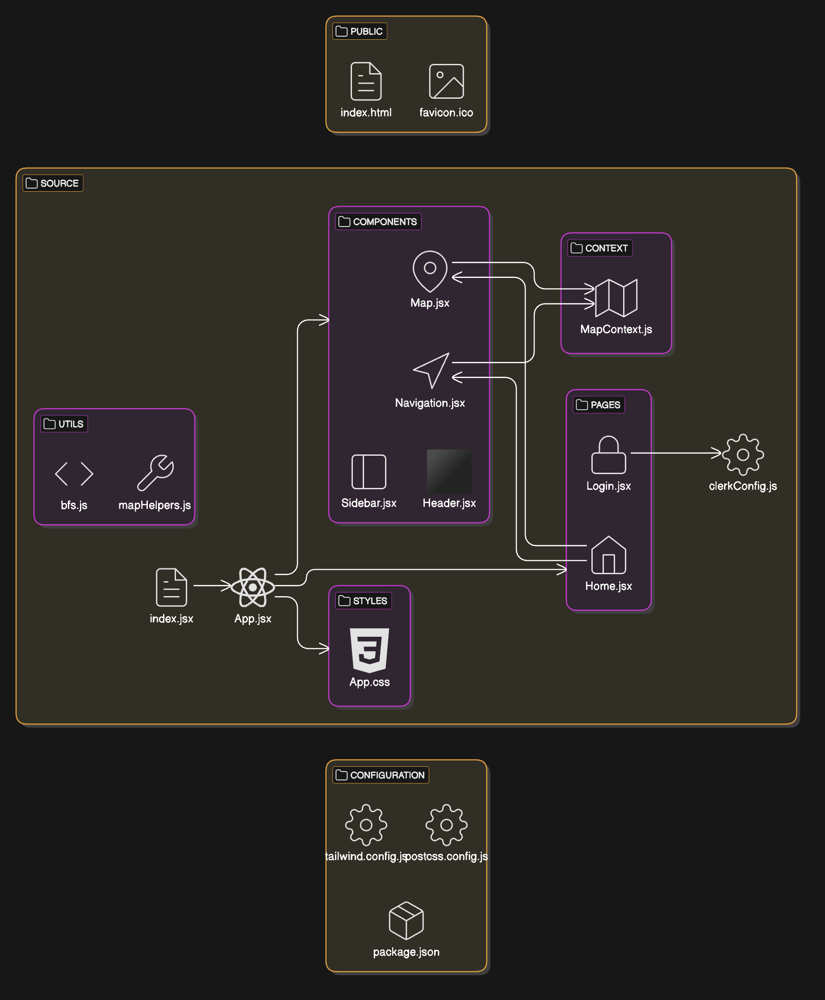
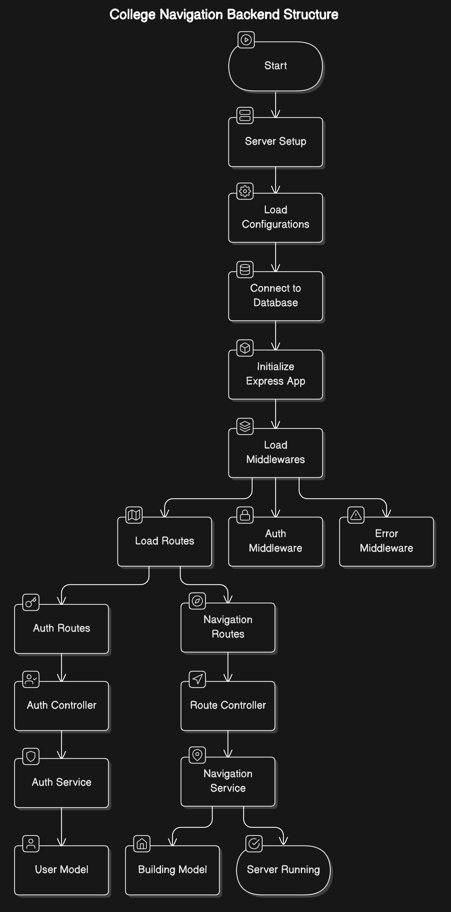

# Campus Navigation System

## Setup Instructions

### Frontend



1. Navigate to the `frontend` folder:
    ```sh
    cd frontend
    ```
2. Install the necessary node modules:
    ```sh
    npm install
    ```

### Backend



The backend folder is currently initialized but does not require any additional setup at this time. soon workable